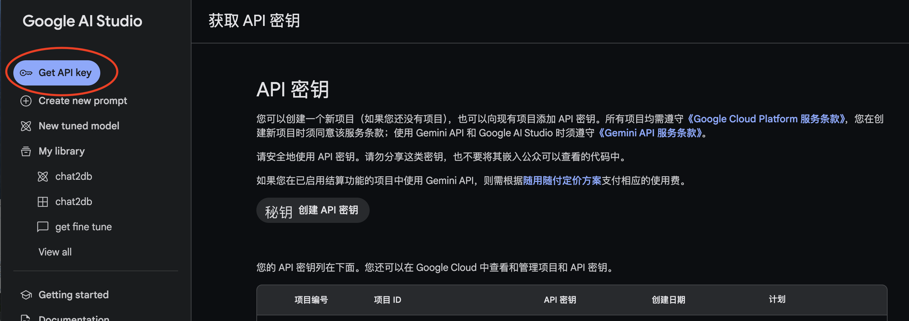

# 0费用搭建GPT聊天网站

本篇将通过谷歌Gemini和开源GPT前端搭建一个0费用维护的套壳gpt网站，可用于个人、团队、或进行二次开发。

## 整体步骤

1. 获取Gemini的API key
2. fork开源GPT前端
3. 通过vercel部署
4. 映射个人或公司域名

## 1.获取Gemini的API key

[Google Al Studio](https://aistudio.google.com/app/apikey) 是谷歌的ai开发平台，不同于普通Gemini的聊天界面，此页面可以创建API key，使用Gemini api开发自己的应用。

此时会获取一个sk开头的key，和OPEN AI的api用法一致，保存好，后面会在配置vercel中用到。

免费版可以每天请求1500次，如果一个人工作中高频使用，一天请求大概是在50次，足够20到30人团队使用。[官网收费计划](https://ai.google.dev/pricing)

## 2.fork开源GPT前端

使用[ChatGPT-Next-Web](https://github.com/ChatGPTNextWeb/ChatGPT-Next-Web)进行页面的搭建，建议详细看一下官方的readme，其中说明了如何部署、参数该配置等。

fork项目到自己的github账号

## 3.通过vercel部署

首先要注册账号，可以直接使用github账号

[vercel官网](https://vercel.com/)

具体介绍可以看博客[Vercel：前端部署托管平台](../building/vercel.md)

1. 创建一个项目，选择刚才fork下来的ChatGPT-Next-Web项目
2. 创建时配置环境变量`GOOGLE_API_KEY`，value 为第一步获取的的Gemini api key，配置`CODE`，value为想要的密码
3. 点击`Deploy`部署项目

## 4.映射个人或公司域名

vercel虽好，但是部署后，域名时vercel创建的，国内无法访问。此时需要一个国内能访问的域名，可以在国内的云平台购买。

[官方参考文档](https://vercel.com/docs/projects/domains/add-a-domain)

在**setting**中将自己的域名添加进去，可以指定子域名，比如 chat.xxx.com，此时会生成一个DNS配置示例，目的是将子域名与vercel给的`cname.vercel-dns.com`进行映射

在域名服务商中，将此域名配置在DNS中，类型`CNAME`，子域名`chat`， 内容 `cname.vercel-dns.com`。
