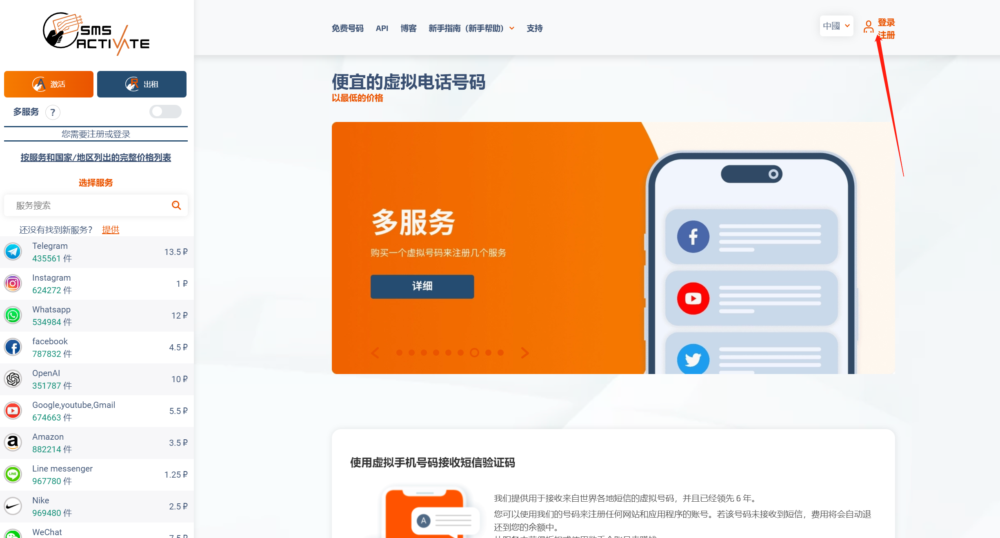
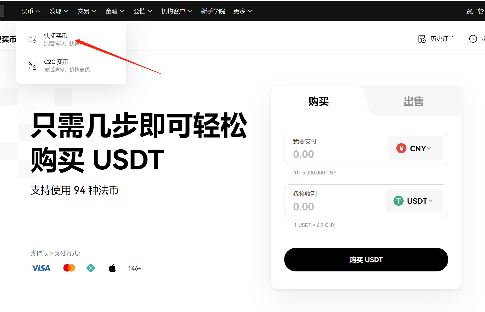
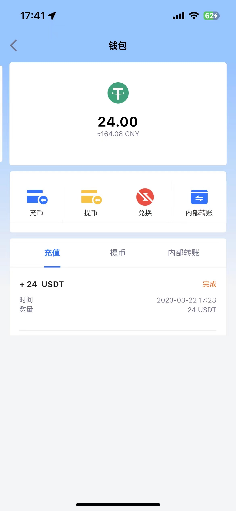
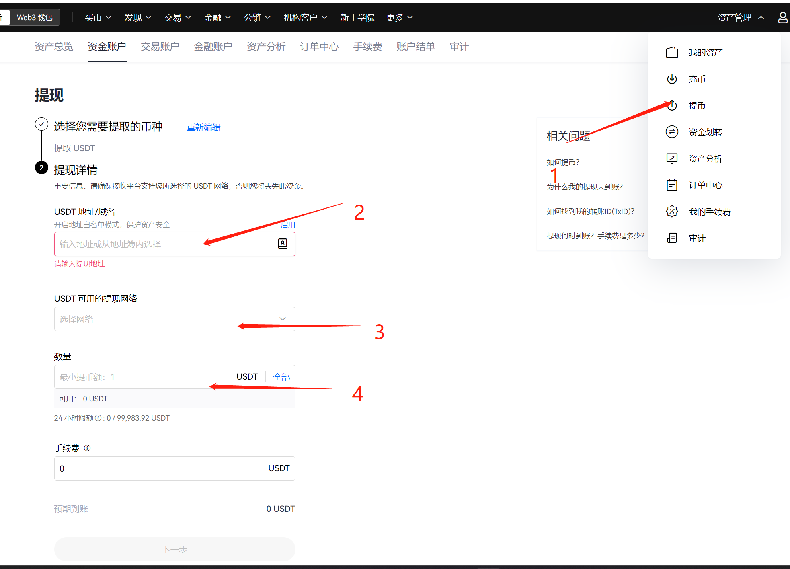

# 购买chatGPT plus的历程
### date：2023-06-03 添加了使用IOS订阅plus的方法，以应对web端对Depay卡号的封禁
[通过chatGPT IOS订阅plus](./subscribe-by-ios.md)
## 前提
1. 需要科学上网工具，并且可以连接欧美节点
2. 如果是iphone，需要apple id 设置为美国
    可以注册一个美国的新账号下载相关Depay和ChatGPT，以及后期的ios端订阅plus

## 1.注册一个chatGPT账号
网上有很多教程，这里放一个，大概步骤就是通过虚拟号平台接收短信验证码去注册。
短信验证码发送 https://sms-activate.org （成本不到5元）

参考教程：https://www.awyerwu.com/9273.html
## 2.注册一个数字货币账户（OKX）
前提：不需要科学上网

https://www.cnouyi.care/cn
这是一个数字货币平台，可以下载客户端、网页、app进行交易操作。移动端如果使用的是ios系统，需要将app store地址换成美国，地址可以用（https://www.meiguodizhi.com/ ）生成一个。我这里用的是客户端，也可以进行充值，转账操作。

- 购买25个USDT（是一种约等价于美元的虚拟货币），用于转给Depay的卡内

ps：交易页面是通过微信支付宝个人转账。24小时内不能进行交易，要等到第二天才能转到Depay

踩坑：不用新建一个apple id账号，新建账号重新登录回员账号可能会有同步icloud问题，系统问icloud的数据是否合并时，要选择合并。

## 3.注册一个虚拟储蓄卡（Depay）
前提： 科学上网、app store地址为美国

Depay可以创建外国虚拟卡，可以支持数字货币的转入，通过将USDT转入Depay，再提现成美元到卡中，用这个卡才能完成chatGPT订阅付费。办理卡有四种选项，有不同的手续费或办理条件。我选的是标准版，有每月1美元的费用。

- 在应用商店下载Depay，并创建一张虚拟卡

ps：有视频实名认证，手机、邮箱绑定，国内的就可以
## 4.将OKX中的虚拟货币转入Depay
输入Depay账号的地址和频道，不能错，错了就充不上了。系统会一直提示你确认网络和地址的正确性。

 过几分钟后刷新钱包就能看到提现成功了， 收取了1个币的手续费。

- 下一步将USDT兑换成美元

## 5.使用Depay订阅chatGPT plus

- 输入Depay的账号信息
- 输入地址，使用 https://www.meiguodizhi.com/ 生成地址  （输入后会显示账单金额，如果有税费就换个免税的地址）

ps： 遇到提示卡不可用的情况，重新开一个无痕，换个节点。我重试了一次就成功了

参考链接：

https://www.v2ex.com/t/915073

https://blog.laoda.de/archives/chatgpt-plus-depay

http://www.itbear.com.cn/html/2023-02/445655.html
