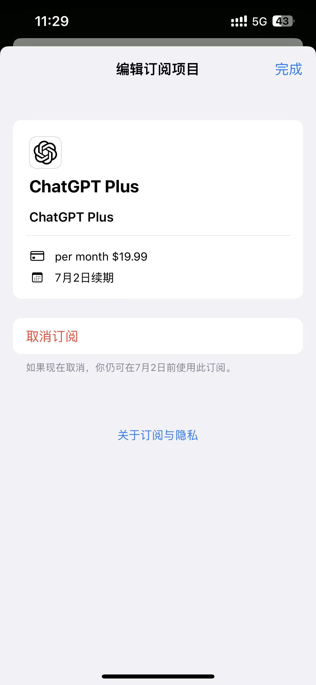

# 通过chatGPT IOS订阅plus

## 前提
- 拥有app store美区账户
- 拥有Depay虚拟卡或其他国际虚拟卡或美区实体卡

如果你已经按照 [购买chatGPT plus的历程](./chatGPT-plus-guide.md)进行了操作，那已经满足了上述条件。

## 文章背景

本来通过[购买chatGPT plus的历程](./chatGPT-plus-guide.md)在网页上开通了plus，用了一个月后发现没扣我卡里的钱进行续订（可能是当时没有足够的余额），不过plus仍然可以使用，就继续用了一个月。就在又一个月后的续订日，订阅被取消了。即使有足够的余额，重新订阅回提示信用卡拒绝。

后续一段时间chatGPT出了ios，网上很多通过礼品卡去进行订阅。不想那么折腾，所以就没想过用那种方式，因为使用礼品卡如果也拒绝，还要找苹果客服进行退款。

就在今天，直接用depay的卡在ios订阅成功了，在此写下开通方法。

## 1.下载chatGPT IOS应用
将app store账号切换为美区，或使用美区地址的新账号，即可搜索并下载使用。

## 2.app内订阅
保持app store账号是美区账号，目的是保证订阅按钮能够点击，使用国内账号，按钮是不能点的。

点击**setting** -> 点击 **Subscription** 

此时会有订阅界面，提示$19.99 订阅费。

点击订阅，会弹出下载app或者订阅付费内容的双击电源确认。

此时会有选择支付方式和显示你app store绑定地址的界面，选择**信用卡**方式

下一步就是绑定信用卡，我们填上Depay的卡号、有效期和CVV

点击确认，即可完成订阅

## PS
订阅后会直接扣费，去Depay查看发现扣了$21.19，通过一番查询，在itunes 看到了自己的app stroe地址，填的是肯塔基州，6%的税费，计算后确定这个和美区地址对应的税法有关，可以在ituns或者app store更换没有税的地址后再进行订阅

[美国税收查询](http://www.offshoreisle.com/artview-465-27.html)

[美国地址生成](https://www.meiguodizhi.com/)
