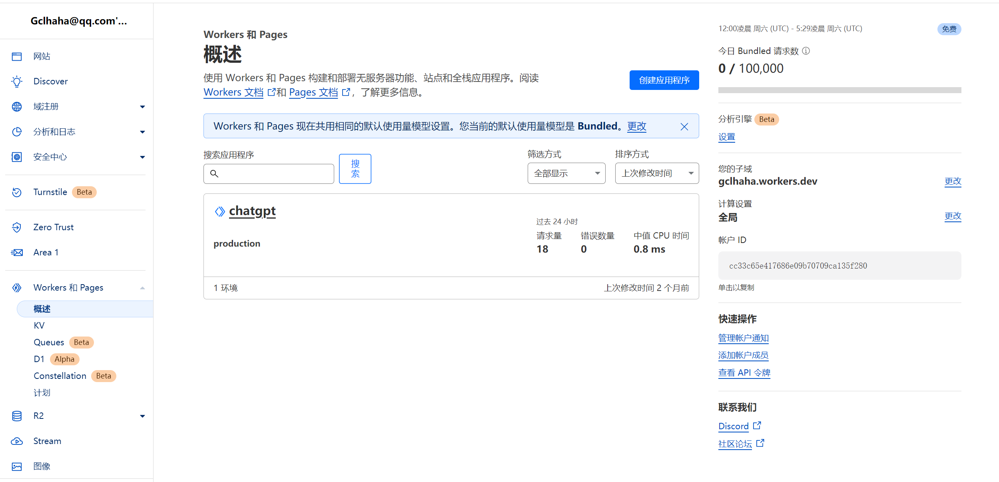
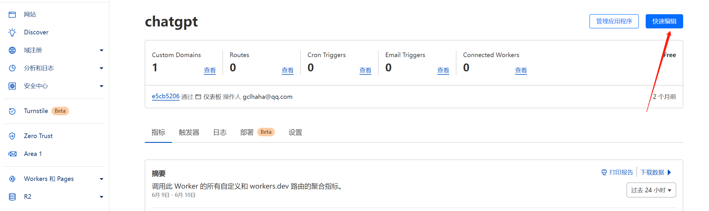
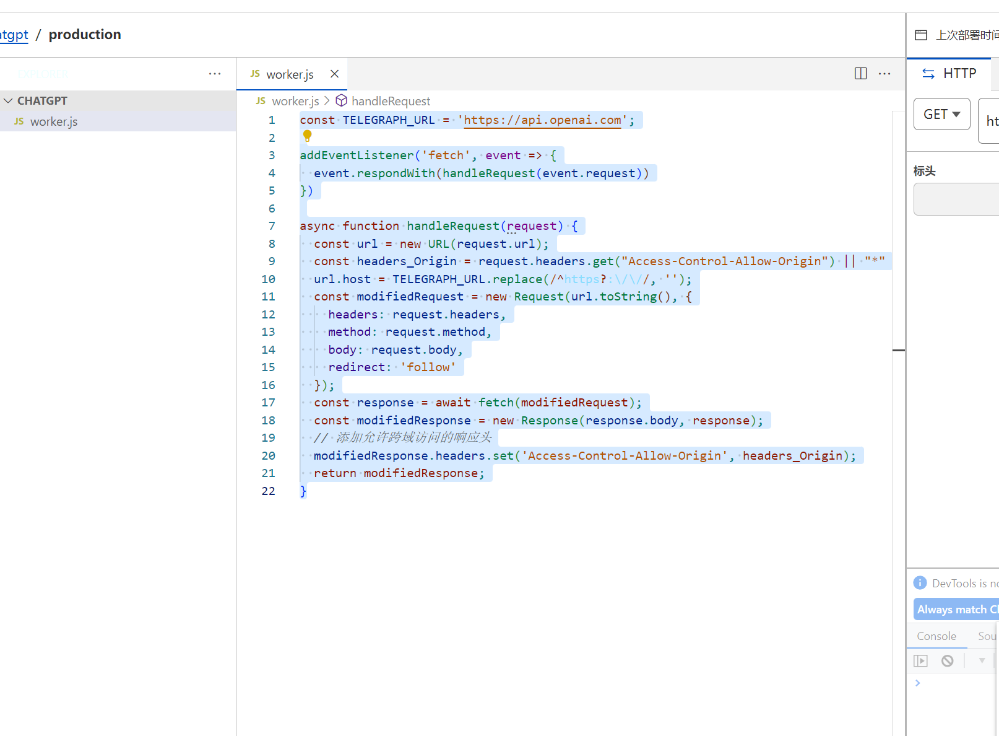

# 通过Cloudflare Worker 功能科学访问OpenAI或其他API地址

众所周知，国外的网站在国内的网络或者国内的服务器是无法访问的。但是我们又希望能够通过某种方式，让服务器能够不迁移到国外节点的情况下实现多外部服务的访问，接下来就是本篇主角，Cloudflare Worder。

[Cloudflare Workers](https://developers.cloudflare.com/workers/) 是一个轻量级的JavaScript执行环境，允许开发者在Cloudflare的边缘网络上运行代码。这意味着您可以在离用户最近的地方运行代码，从而实现无与伦比的性能和响应速度。Cloudflare Workers支持使用WebAssembly，允许在浏览器外运行高性能的二进制代码。

## 实现访问OpenAI API

使用此方式可以解决国内服务器无法访问openai接口的问题，能够让你的应用轻松的使用AI能力

免费的worker可以每天访问10万次，对于个人项目来说足够了。



worker的首页展示了所有创建的worker



1. 我们创建或编辑worker，会有个编写代码的界面，这里我们可以直接粘贴代码

```js
const TELEGRAPH_URL = 'https://api.openai.com';

addEventListener('fetch', event => {
  event.respondWith(handleRequest(event.request))
})

async function handleRequest(request) {
  const url = new URL(request.url);
  const headers_Origin = request.headers.get("Access-Control-Allow-Origin") || "*"
  url.host = TELEGRAPH_URL.replace(/^https?:\/\//, '');
  const modifiedRequest = new Request(url.toString(), {
    headers: request.headers,
    method: request.method,
    body: request.body,
    redirect: 'follow'
  });
  const response = await fetch(modifiedRequest);
  const modifiedResponse = new Response(response.body, response);
  // 添加允许跨域访问的响应头
  modifiedResponse.headers.set('Access-Control-Allow-Origin', headers_Origin);
  return modifiedResponse;
}
```

如下图所示，保存后即可



2. worker可以绑定域名，也可以使用router或者域名的方式，我们需要将域名转移到Cloudflare，进入刚创建的worker中，在``设置``中添加自定义的域名。就可以用可访问的域名来实现对不可访问的域名进行访问。举一反三，灵活使用。

举例：比如我的主域名是aaa.com 那么添加openai.aaa.com作为worker类型的dns，我们访问openai.aaa.com就等于访问api.openai.com