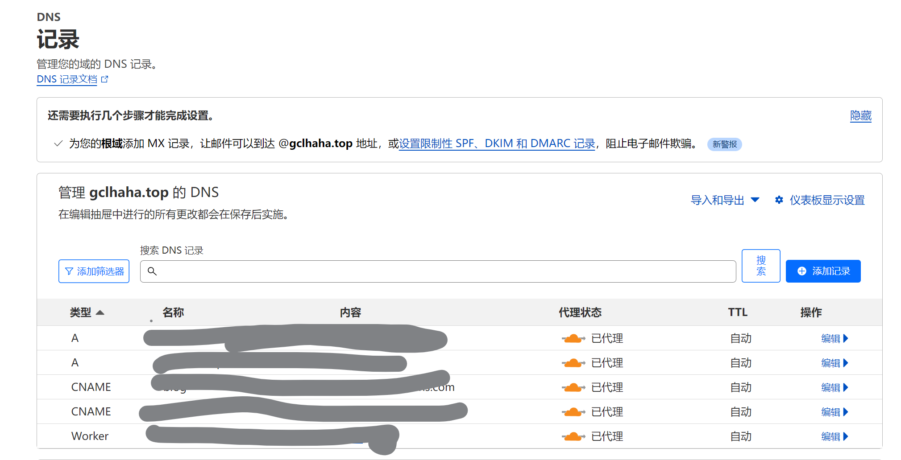
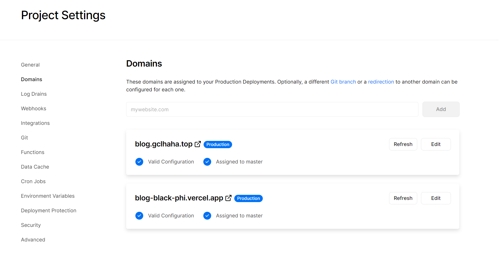
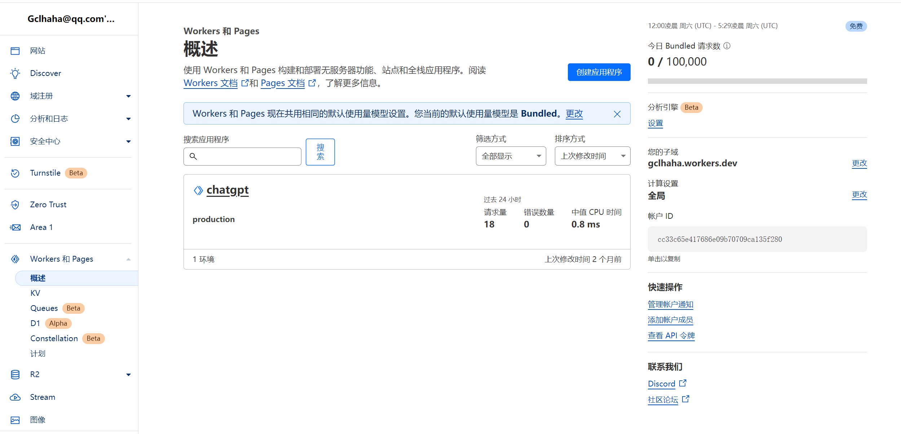
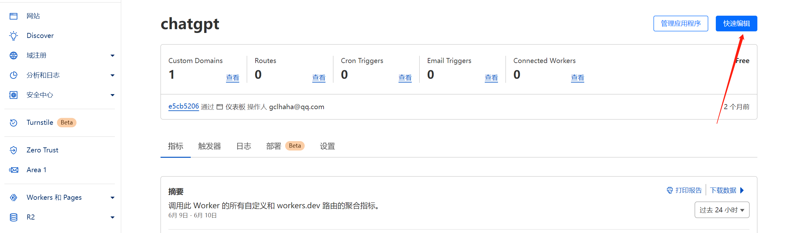
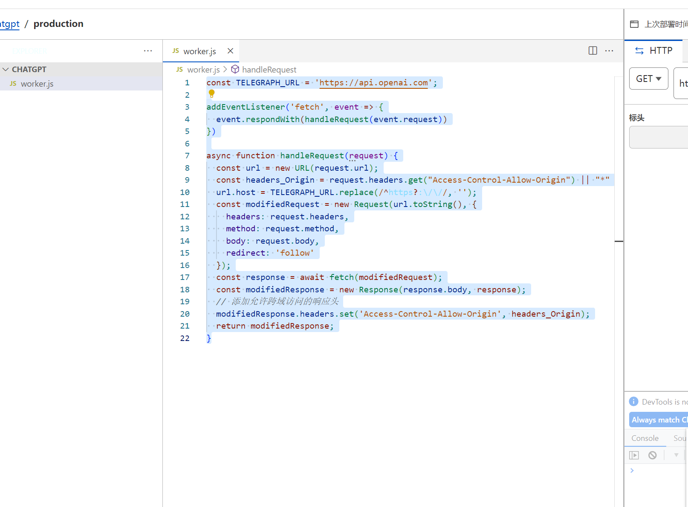

# 云端的守护者：Cloudflare

[Cloudflare](https://www.cloudflare.com/) 是一家美国的IT服务公司，旨在提供内容分发网络服务，DDoS防御服务，安全和分布式域名服务器服务。Cloudflare的服务将您的网站数据分布在全球，通过智能路由，优化传输，以提高速度和可靠性。

## 域名服务

Cloudflare 提供全面的[域名服务](https://developers.cloudflare.com/registrar/)，包括域名注册，转移，管理等。使用Cloudflare，您可以直接在一个平台上管理您的所有网站资源，包括域名，无需再担心跨平台的复杂性。

## DNS服务

Cloudflare 的 [DNS 服务](https://developers.cloudflare.com/dns/) 是全球最大，最快的DNS服务之一。它提供免费，安全，快速的DNS解析服务。此外，它还提供DNSSEC，以保护您的网站不受DNS欺骗攻击。



我们在Vercel上部署的网站，vercel会提供一个专属的vercel的域名，但是国内无法访问，不过我们可以设置域名，并根据提示绑定到Cloudflare上，这样就可以轻松愉快的使用自定义的域名访问了。我的主域名是gclhaha.top，博客项目设置的子域名是blog.gclhaha.top，就可以通过blog.gclhaha.top访问博客了。

<center>Vercel的域名设置页面</center>

### 关联文章
[Vercel：前端部署托管平台](./vercel.md)
## Workers

[Cloudflare Workers](https://developers.cloudflare.com/workers/) 是一个轻量级的JavaScript执行环境，允许开发者在Cloudflare的边缘网络上运行代码。这意味着您可以在离用户最近的地方运行代码，从而实现无与伦比的性能和响应速度。Cloudflare Workers支持使用WebAssembly，允许在浏览器外运行高性能的二进制代码。

### 实现访问OpenAI API

使用此方式可以解决国内服务器无法访问openai接口的问题，能够让你的应用轻松的使用AI能力

免费的worker可以每天访问10万次，对于个人项目来说足够了。




worker的首页展示了所有创建的worker



我们创建或编辑worker，会有个编写代码的界面，这里我们可以直接粘贴代码

```js
const TELEGRAPH_URL = 'https://api.openai.com';

addEventListener('fetch', event => {
  event.respondWith(handleRequest(event.request))
})

async function handleRequest(request) {
  const url = new URL(request.url);
  const headers_Origin = request.headers.get("Access-Control-Allow-Origin") || "*"
  url.host = TELEGRAPH_URL.replace(/^https?:\/\//, '');
  const modifiedRequest = new Request(url.toString(), {
    headers: request.headers,
    method: request.method,
    body: request.body,
    redirect: 'follow'
  });
  const response = await fetch(modifiedRequest);
  const modifiedResponse = new Response(response.body, response);
  // 添加允许跨域访问的响应头
  modifiedResponse.headers.set('Access-Control-Allow-Origin', headers_Origin);
  return modifiedResponse;
}
```

如下图所示，保存后即可



worker可以绑定域名，也可以使用router或者域名的方式，我们需要将域名转移到Cloudflare，然后在worker的设置中添加域名自定义的域名。

比如我的主域名是aaa.com 那么添加openai.aaa.com作为worker类型的dns，我们访问openai.aaa.com就等于访问api.openai.com


## 结束语

*重点：免费使用*

Cloudflare通过提供全球最大的安全性能网络，保护和加速网站，应用，API，和其他与Internet相关的一切。它是创建和运行现代化应用的理想平台。

更多详情，请访问[Cloudflare官网](https://www.cloudflare.com/)。

