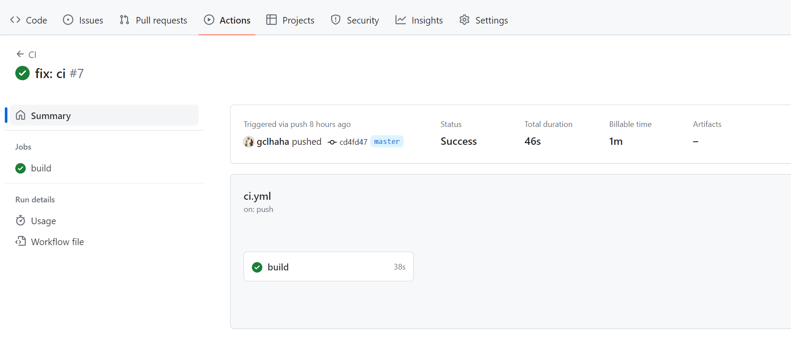

# Github Action: 自动化构建

此前的文章中有使用vercel部署应用的教程，其中就使用了Github Action来自动化构建。在vercel中关联github仓库后，vercel会自动创建一个github action的配置文件，这个配置文件会在每次提交代码后自动构建应用。

我们除了通过第三方托管的方式构建和部署应用。还可以通过Github Action来自动化构建，这样就可以在自己的服务器上部署应用了。

此篇文章使用github action 构建了一个Go的应用，然后部署到自己的服务器上。

## 为什么要使用Github Action

如果我们不使用自动化构建的工具，那么我们每次更新应用的时候，都需要手动的登录服务器，将本地的代码编译或通过上传编译后文件或者项目源码的方式上传到服务器，在手动编译或替换文件。如果是后端项目，还要手动重新运行项目。这样的过程非常繁琐。

如果使用Github Action，那么我们只需要在本地编写好构建脚本，然后将脚本上传到github仓库中，然后在github仓库中配置好action，那么每次提交代码后，github action就会自动的执行我们的构建脚本，然后将构建后的文件上传到我们的服务器上。

## Github Action的使用

在项目根目录下创建一个`.github`文件夹，然后在`.github`文件夹下创建一个`workflows`文件夹，然后在`workflows`文件夹下创建一个`ci.yml`文件，这个文件就是我们的构建脚本。

目录结构是github规定的


```yaml
name: CI

on:
  push:
    branches:
      - master # 触发工作流的分支

jobs:
  build:
    runs-on: ubuntu-latest

    steps:
      - name: Checkout code
        uses: actions/checkout@v3

      - name: Set up Go
        uses: actions/setup-go@v3
        with:
          go-version: 1.18.x

      - name: Install dependencies
        run: go mod download

      - name: Build
        run: go build -o my-app ./cmd/main.go

      - name: Copy binary to server
        uses: appleboy/scp-action@v0.1.1
        with:
          host: ${{ secrets.SERVER_HOST }}
          username: ${{ secrets.SERVER_USERNAME }}
          key: ${{ secrets.SERVER_KEY }}
          source: "./my-app"
          target: "/var/www/ai-tool"

      - name: Execute deployment script on server
        uses: appleboy/ssh-action@v0.1.3
        with:
          host: ${{ secrets.SERVER_HOST }}
          username: ${{ secrets.SERVER_USERNAME }}
          key: ${{ secrets.SERVER_KEY }}
          script: |
            cd /var/www/ai-tool
            chmod +x my-app
            ./my-app &

```

脚本解释如下

```yaml
name: CI  # 工作流名称

on:
  push:
    branches:
      - master # 触发工作流的分支，此处为主分支

jobs:
  build:
    runs-on: ubuntu-latest # 运行工作流的操作系统版本，此处为最新版Ubuntu

    steps:
      - name: Checkout code # 步骤名称
        uses: actions/checkout@v3 # 使用GitHub官方的checkout操作获取代码

      - name: Set up Go
        uses: actions/setup-go@v3 # 设置Go环境
        with:
          go-version: 1.18.x # 指定Go的版本

      - name: Install dependencies
        run: go mod download # 下载项目依赖

      - name: Build
        run: go build -o my-app ./main.go # 构建Go应用

      - name: Copy binary to server
        uses: appleboy/scp-action@v0.1.1 # 使用第三方scp-action将构建的二进制文件复制到服务器
        with:
          host: ${{ secrets.SERVER_HOST }} # 服务器地址
          username: ${{ secrets.SERVER_USERNAME }} # 服务器用户名
          key: ${{ secrets.SERVER_KEY }} # 服务器密钥
          source: "./my-app" # 要复制的源文件路径
          target: "/your/target-path" # 服务器上的目标路径

      - name: Execute deployment script on server
        uses: appleboy/ssh-action@v0.1.3 # 使用第三方ssh-action在服务器上执行命令
        with:
          host: ${{ secrets.SERVER_HOST }} # 服务器地址
          username: ${{ secrets.SERVER_USERNAME }} # 服务器用户名
          key: ${{ secrets.SERVER_KEY }} # 服务器密钥
          script: |
            cd /your/target-path # 切换到目标目录
            chmod +x my-app # 赋予应用可执行权限
            ./my-app & # 在后台运行应用


```

构建好脚本后，我们需要将脚本上传到github仓库中，脚本部分就结束了。剩下的就是配置服务器公钥和github仓库的密钥，以及服务器信息。

## 获取并配置github action相关参数

首先进入项目的 **setting** 中


**Secrets and variables** ->  **Actions** ->  **New repository secret**，然后添加以下三个密钥


- SERVER_HOST：服务器地址
- SERVER_USERNAME：服务器用户名
- SERVER_KEY：服务器密钥

服务器地址和服务器用户名比较容易明白，其中服务器密钥要分步骤获取和配置

### 配置github

其中我的脚本是使用ssh密钥去进行连接的，所以需要在要部署的服务器上配置公钥，然后将私钥配置到github仓库中。

本人使用的是阿里云服务器，但是步骤大致类似

生成服务器的连接密钥


如图生成密钥后，默认是空的，生成后会将密钥下载到本地。

此时会获得github action.pem 文件，其中存放着私钥，我们需要将私钥配置到github仓库中。

将pem文件中的所有内容复制到**SERVER_KEY**中


此时github这边的所有配置都已经完成了，接下来就是配置服务器。

### 配置服务器

目前github action已经获取了服务器的私钥，但是没有在服务器中配置公钥，我们无法通过私钥连接到服务器。

1. 生成公钥

打开终端，进入私钥同级目录，输入以下命令

```shell
ssh-keygen -y -f yourkey.pem > yourkey.pub
```

这样我们就获得了公钥。

2. 配置公钥

连接服务器，将公钥复制到服务器的`~/.ssh/authorized_keys`文件中

```shell
cat yourkey.pub >> ~/.ssh/authorized_keys
```
或使用vim编辑器打开`~/.ssh/authorized_keys`文件，将公钥内容复制到文件中

3. 配置目录和文件权限

```shell
chmod 700 ~/.ssh
chmod 640 ~/.ssh/authorized_keys
```

这样就完成了服务器的配置，接下来就可以测试一下了。

## 测试

在本地修改代码，然后提交到github仓库中，然后查看github action的运行情况



如果运行失败，根据提示信息进行修改，如果运行成功，那么就可以在服务器上查看应用是否已经部署成功了。


## 总结

通过github action，我们可以在本地编写好构建脚本，然后将脚本上传到github仓库中，然后在github仓库中配置好action，那么每次提交代码后，github action就会自动的执行我们的构建脚本，然后将构建后的文件上传到我们的服务器上。开心又愉快。

更进阶的使用可以使用docker，可以在github action中使用docker构建应用，然后将构建后的镜像上传到docker仓库，然后在服务器上拉取镜像，这样就可以实现一键部署了。好处是不用在服务器上安装Go环境，只需要安装docker就可以了。后续会有相关文章介绍。
