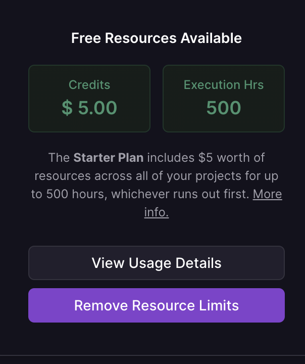

# Railway：构建，部署和扩展应用程序的新方式

[Railway](https://railway.app/) 是一款新型的开发者工具，使开发者能够更方便、快捷地构建，部署和扩展应用程序。这个平台主要解决了一些日常开发过程中的困扰，例如环境配置、部署、扩展等问题。

## Railway的核心功能

Railway.app 主要提供以下功能：

1. **无缝的部署：** 无论你是一个初学者还是有经验的开发者，Railway都提供了非常方便快捷的部署方法。你可以在本地或者在Railway的线上环境中部署你的项目。

2. **内置的持续集成/持续部署（CI/CD）：** Railway有自己的CI/CD系统，这使得你可以在代码提交后立即进行构建和部署，让你的项目总能保持最新状态。

3. **预配置环境：** Railway提供了预配置环境，你可以在这些环境中选择适合你项目的环境，这极大地减少了环境配置的困扰。

4. **一体化的数据库管理：** Railway提供了一体化的数据库管理功能，你可以非常方便地在你的项目中添加或者管理数据库。

5. **扩展性强：** Railway有着非常强的扩展性，你可以根据你的项目需要添加各种各样的插件。

## 如何开始使用Railway？

开始使用Railway非常简单，只需要几个步骤：

1. 打开[Railway的官网](https://railway.app/)，点击`Start for free`按钮注册并登录。

2. 创建你的第一个项目。你可以选择使用Railway的模板，也可以从零开始创建你的项目。

3. 在创建项目的过程中，选择合适的环境配置和数据库。

4. 将你的代码提交到Railway，通过Railway的CI/CD系统进行部署。

5. 一切就绪后，你的项目就已经在线上运行了。你可以在Railway的管理面板中查看你的项目状态，进行进一步的管理和调整。

railway 提供了免费试用的额度

## 总结

Railway.app为开发者提供了一个强大的平台，使得构建，部署和扩展应用程序变得更加简单。无论你是一个初学者，还是一个有经验的开发者，都值得一试。
