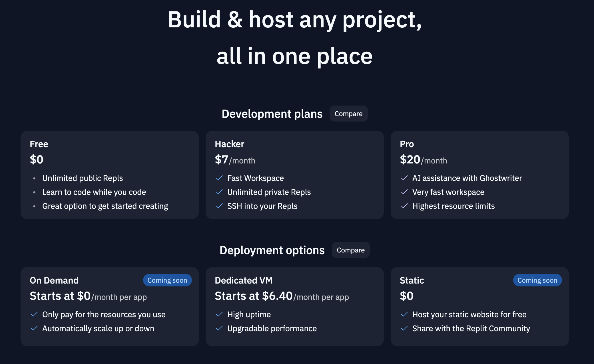

# Replit: 全新的在线编程环境

你是否曾在寻找一个可以实时共享、迅速部署并支持多种编程语言的代码编辑器？如果是的话，那你应该试试 [Replit](https://replit.com/)。本篇文章将对Replit进行介绍，让你更好地理解它的特性和用法。

## 什么是 Replit?

Replit是一个在线的集成开发环境（IDE），支持多种编程语言。Replit的目标是为开发者提供一个方便快捷、无需本地设置的编程环境。使用Replit，你可以从任何电脑或浏览器直接创建、运行和分享你的项目。

## Replit的主要特性

### 1. 支持多种编程语言

Replit 支持众多编程语言，包括 Python，JavaScript，Java，C++，HTML/CSS，等等。这使得你无需为不同的编程语言安装不同的开发环境。

### 2. 实时协作

你可以和你的队友在同一个Replit项目中同时编程，就像Google文档一样。你可以看到他们正在编辑的内容，使得远程团队协作变得更加容易。

### 3. 一键部署

在Replit上，你可以用一键部署你的web应用，并获取一个可以分享的公开链接。这是个很好的方式来进行项目演示或共享你的成果。

## 怎样开始使用 Replit?

只需访问 [Replit.com](https://replit.com/) 并注册一个账号。你可以选择使用谷歌、Github、Facebook的账号进行登录，或者使用电子邮件创建一个新的账号。注册后，你就可以开始创建你的第一个Replit项目了。

## 结论

无论你是一个经验丰富的开发者，还是一个刚刚开始编程的新手，Replit都是一个值得试试的工具。它提供了一个易于使用且功能强大的开发环境，让编程变得更加便捷。
