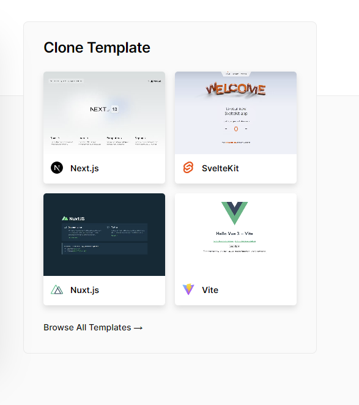
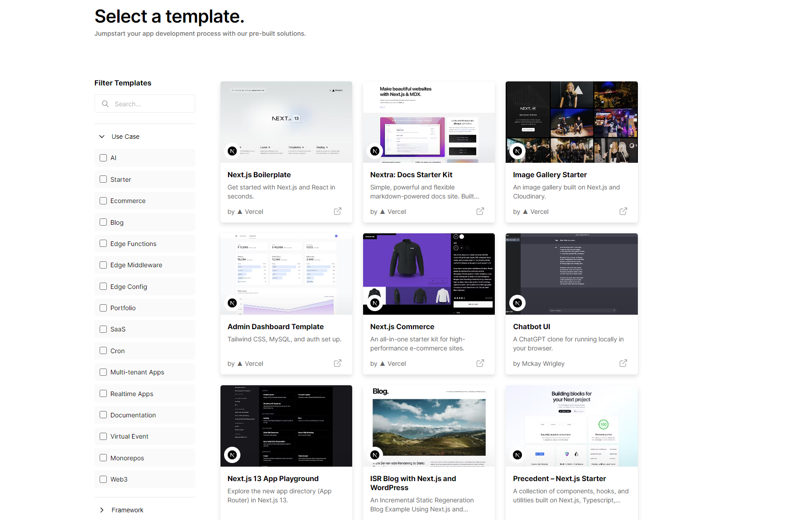

# Vercel：前端部署托管平台

[Vercel](https://vercel.com/) 是一个为开发者提供前端部署服务的平台。它让前端项目的构建、部署变得更简单，只需要几分钟，你的网站就可以在全球范围内访问。

## 什么是 Vercel？

Vercel 是一个专门为 Jamstack 网站和应用提供部署的平台，它可以将你的前端代码直接部署到它的全球边缘网络上。这个网络有超过 70 个数据中心，可以确保你的网站在全球任何地方都有最快的加载速度。

Vercel 的名字来源于其核心理念，即"Versatile Cell"（多功能单元），强调其对于前端项目的各种可能性和灵活性。

## Vercel 的前端部署功能

Vercel 的前端部署功能非常强大，它支持各种前端框架，如 React、Vue、Angular 等，也支持静态网站生成器，如 Next.js、Gatsby、Hugo 等。你只需要将你的代码托管在 GitHub、GitLab 或 Bitbucket 上，Vercel 就可以自动为你的项目进行构建和部署。

还可以使用提供的模板，快速的创建一个新的项目。Vercel 会自动为你的项目创建一个 GitHub 仓库，并将其部署到 Vercel 的服务器上。你可以在 Vercel 的仪表板上查看你的项目，并进行管理。

Vercel 还提供了一种名为"Serverless Functions"的功能，允许开发者在前端项目中添加服务器端的逻辑。这些函数会在 Vercel 的服务器上运行，无需开发者管理任何服务器。

### 如何使用 Vercel 进行前端部署

1. 首先，你需要在Vercel官网上注册一个账号。
2. 然后，将你的代码托管在 GitHub、GitLab 或 Bitbucket 上。
3. 在 Vercel 的仪表板上，选择 "New Project"，然后选择你的代码仓库。
4. Vercel 会自动识别你的项目类型，并为你的项目进行构建和部署。

你可以在 Vercel 的[官方文档](https://vercel.com/docs)中找到更详细的步骤。

## 为什么选择 Vercel

Vercel 的目标是让前端部署变得更简单、更快。无论你是一个独立开发者，还是一个大型企业，Vercel 都可以满足你的需要。它让你可以将更多的精力放在代码的编写上，而不是部署的细节。

*注：本项目部署在vercel*