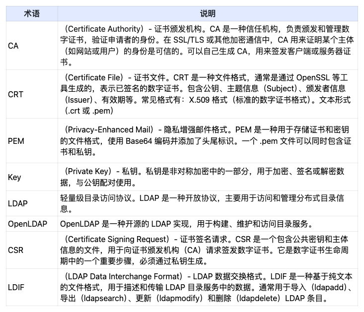
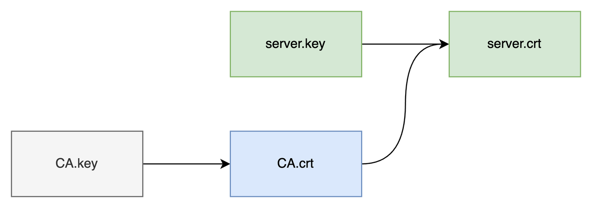
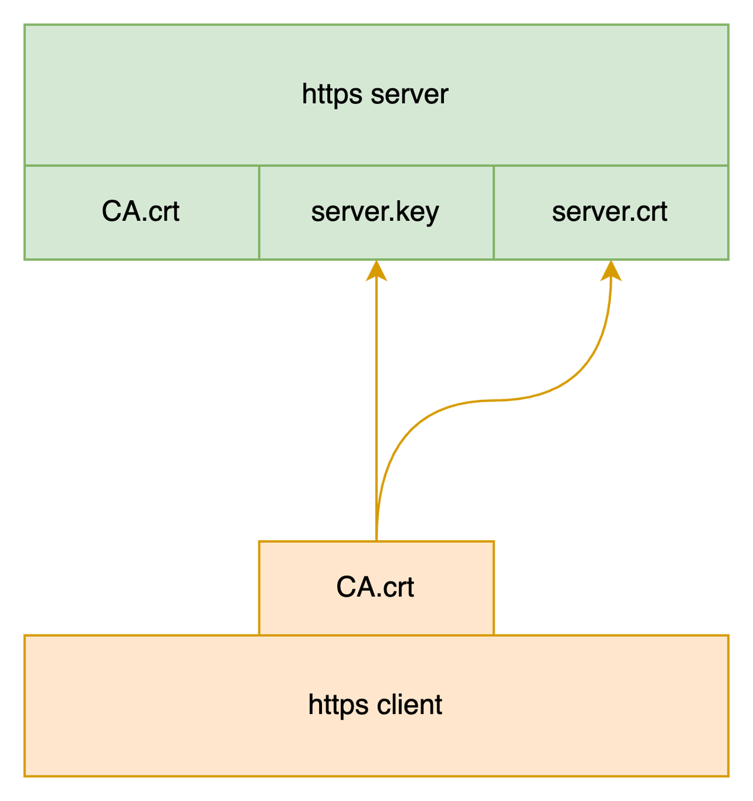
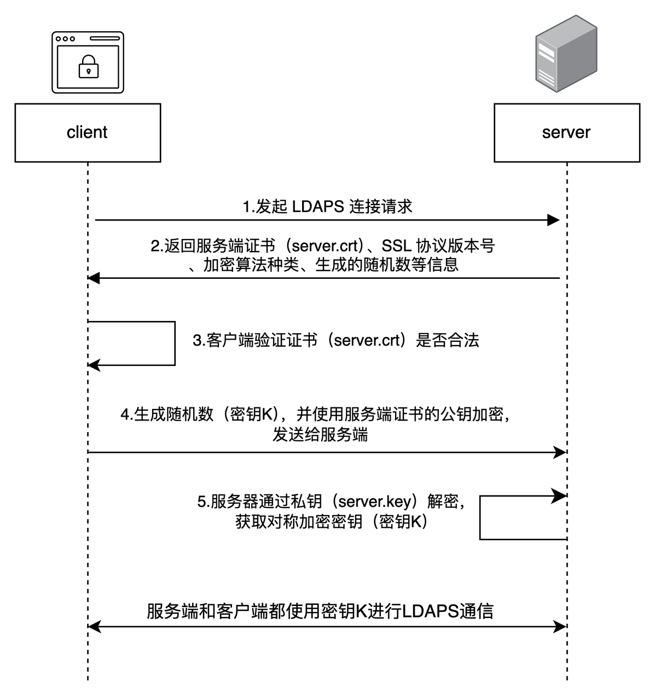

# 3: LDAPS 认证流程

## 术语定义

## 单向认证

单向认证只需要验证服务端的身份，无需验证客户端的身份。

## CA证书

1. 根证书公/私钥对、服务端证书之间的关系

    

2. SSL校验原理

    

## 单向认证流程

1. 客户端发起 LDAPS 建立连接请求，将客户端支持的 SSL 协议版本号、加密算法种类、生成的随机数等信息发送给服务端。
2. 服务端向客户端返回 SSL 协议版本号、加密算法种类、生成的随机数等信息，以及服务端的证书（server.crt）。
3. 客户端验证证书（server.crt）是否合法，并从此证书中获取服务端的公钥：

   - 检查证书是否过期。
   - 检查证书是否已经被吊销。
   - 检查证书是否可信。
   - 检查收到的证书中的域名与请求的域名是否一致。

4. 证书验证通过后，客户端生成一个随机数（密钥 K），作为通信过程中对称加密的密钥，并用服务端证书的公钥进行加密，然后发送给服务端。
5. 服务端收到客户端发送的加密信息后，使用私钥（server.key）进行解密，获取对称加密密钥（密钥 K）。 在接下来的会话中，客户端和服务端将会使用该对称加密密钥（密钥 K）进行通信，保证通信过程中信息的安全。
