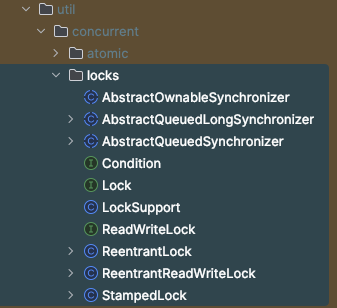

# 源码分析：Java Lock

包结构如下



总共三种锁，**ReentrantLock**，**ReentrantReadWriteLock**，**StampedLock**

## ReentrantLock

ReentrantLock 是一种可重入的互斥锁，其基本行为和语义与通过 `synchronized` 方法和语句访问的隐式监视器锁相同，但提供了扩展功能。

- **锁的所有权**：ReentrantLock 由最后成功获取锁但尚未释放锁的线程拥有。当一个线程调用 `lock` 方法时，如果锁未被其他线程占用，该方法将成功返回并获取锁。如果当前线程已经持有锁，`lock` 方法会立即返回，这可以通过 `isHeldByCurrentThread` 和 `getHoldCount` 方法检查。

- **公平性参数**：ReentrantLock 的构造函数接受一个可选的公平性参数。当设置为 `true` 时，在竞争情况下，锁会优先授予等待时间最长的线程。如果设置为 `false`（默认情况），则不保证任何特定的访问顺序。使用公平锁的程序在多线程访问时，整体吞吐量可能会较低（即，运行速度较慢），但获取锁的时间方差较小，并且可以保证不会发生线程饥饿。然而，需要注意的是，锁的公平性并不等同于线程调度的公平性。因此，使用公平锁的多个线程中，一个线程可能连续多次获得锁，而其他活跃线程无法获得进展。此外，`tryLock()` 方法不受公平性设置的约束。如果锁可用，即使其他线程正在等待，`tryLock()` 方法仍会成功。

- **使用建议**：推荐在调用 `lock` 方法后立即使用 `try` 块，通常是以下面的方式：
  
  ```java
  class X {    
      private final ReentrantLock lock = new ReentrantLock();    
      // ...      
      public void m() {      
          lock.lock();  // 阻塞，直到条件满足      
          try {        
              // ... 方法体内容      
          } finally {        
              lock.unlock();      
          }    
      }  
  }
  ```

- **其他功能**：除了实现 `Lock` 接口之外，这个类还定义了许多用于检查锁状态的公共和受保护方法。其中一些方法仅对检测和监控有用。

- **序列化行为**：ReentrantLock 的序列化行为与内置锁相同：反序列化后的锁处于未锁定状态，无论序列化时的状态如何。

- **最大递归锁数量**：该锁支持同一线程的最大递归锁数量为 2147483647 次。如果尝试超过此限制，锁方法将抛出 `Error`。

## ReentrantReadWriteLock

**ReentrantReadWriteLock** 是一种支持类似于 ReentrantLock 的读写锁实现，具有以下特性：

### 1. 获取顺序

- **无偏向模式（默认）**：默认情况下，读锁和写锁的获取顺序不指定，但受可重入性约束。非公平锁在持续竞争下可能会无限期地推迟一个或多个读者或写者线程的执行，但通常比公平锁具有更高的吞吐量。
  
- **公平模式**：当构造为公平模式时，线程将根据大致的到达顺序竞争进入锁。当当前持有的锁释放时，等待时间最长的单个写线程将获得写锁，或者如果有一组比所有等待写线程等待时间更长的读线程，则该组将获得读锁。

### 2. 可重入性

- 允许读者和写者按 ReentrantLock 的方式重新获取读锁或写锁。在写线程释放所有写锁之前，非可重入读者不允许获取读锁。此外，写者可以获取读锁，但读者不能获取写锁。可重入性在某些应用中非常有用，例如在持有写锁期间调用或回调执行读操作的方法时。如果一个读者试图获取写锁，它将永远不会成功。

### 3. 锁降级

- 通过获取写锁，然后获取读锁，最后释放写锁，可以实现从写锁降级为读锁。然而，不可能从读锁升级为写锁。

### 4. 中断支持

- 读锁和写锁都支持在获取锁时的中断操作。

### 5. 条件支持

- 写锁提供了一个条件实现，其行为与 ReentrantLock.newCondition 提供的条件实现相同。这个条件只能与写锁一起使用。读锁不支持条件，调用 `readLock().newCondition()` 会抛出 `UnsupportedOperationException`。

### 6. 监控支持

- 这个类支持用于确定锁是否被持有或争用的方法。这些方法设计用于监控系统状态，而不是用于同步控制。

### 7. 序列化行为

- 与内置锁一样，反序列化后的锁处于未锁定状态，无论序列化时的状态如何。

### 示例用法

- **锁降级示例**：在更新缓存后执行锁降级的代码示例：
  
  ```java
  class CachedData {    
      Object data;    
      boolean cacheValid;    
      final ReentrantReadWriteLock rwl = new ReentrantReadWriteLock();      
      void processCachedData() {      
          rwl.readLock().lock();      
          if (!cacheValid) {        
              rwl.readLock().unlock();        
              rwl.writeLock().lock();        
              try {          
                  if (!cacheValid) {            
                      data = ...;            
                      cacheValid = true;          
                  }          
                  rwl.readLock().lock();        
              } finally {          
                  rwl.writeLock().unlock();        
              }      
          }        
          try {        
              use(data);      
          } finally {        
              rwl.readLock().unlock();      
          }    
      }  
  }
  ```

- **提高并发性**：ReentrantReadWriteLocks 可以在一些集合的大规模并发访问场景中提高并发性。通常在集合较大、读线程多于写线程、操作开销超过同步开销时，使用此锁才有意义。

  ```java
  class RWDictionary {    
      private final Map<String, Data> m = new TreeMap<>();    
      private final ReentrantReadWriteLock rwl = new ReentrantReadWriteLock();    
      private final Lock r = rwl.readLock();    
      private final Lock w = rwl.writeLock();      
      public Data get(String key) {      
          r.lock();      
          try { return m.get(key); }      
          finally { r.unlock(); }    
      }    
      public List<String> allKeys() {      
          r.lock();      
          try { return new ArrayList<>(m.keySet()); }      
          finally { r.unlock(); }    
      }    
      public Data put(String key, Data value) {      
          w.lock();      
          try { return m.put(key, value); }      
          finally { w.unlock(); }    
      }    
      public void clear() {      
          w.lock();      
          try { m.clear(); }      
          finally { w.unlock(); }    
      }  
  }
  ```

### 实现注意事项

- 这个锁支持最多 65535 次递归写锁和 65535 次读锁。尝试超过这些限制将导致锁方法抛出错误。

## StampedLock

**StampedLock** 是一种基于能力的锁，提供了三种模式来控制读写访问。以下是 StampedLock 的关键特性及其总结：

### 1. 三种模式

- **写模式**：`writeLock` 方法可能会阻塞，等待独占访问，并返回一个用于释放锁的标记（stamp）。当锁处于写模式时，不允许获取读锁，所有乐观读验证都会失败。
  
- **读模式**：`readLock` 方法可能会阻塞，等待非独占访问，并返回一个用于释放锁的标记（stamp）。

- **乐观读模式**：`tryOptimisticRead` 方法在锁不处于写模式时返回一个非零标记。`validate` 方法在标记获取后，如果锁未被写模式获取，则返回 `true`。这种模式可以看作是读锁的一种极弱版本，随时可能被写线程打破，适合短暂的只读代码段，以减少争用和提高吞吐量。

### 2. 模式转换

StampedLock 提供了模式之间的转换方法，例如 `tryConvertToWriteLock`，用于尝试将当前模式升级为写模式。StampedLock 的设计帮助减少了因重试而导致的代码冗余。

### 3. 其他特性

- **非重入**：StampedLock 不支持重入，因此持有锁的代码不应调用可能再次尝试获取锁的未知方法。

- **无所有权**：与 Semaphore 类似，StampedLock 没有所有权概念。一个线程获取的锁可以在另一个线程中释放或转换。

- **调度策略**：StampedLock 的调度策略不会始终优先考虑读者或写者，所有“try”方法都是尽力而为的，不一定符合任何调度或公平性策略。

- **内存同步**：成功锁定的操作具有与 Lock 类似的内存同步效果。乐观读使用的同步保证只有在 `validate` 方法返回 `true` 时有效。

### 4. 示例用法

以下是一个简单的示例，展示了如何使用 StampedLock 在一个维护二维点的类中实现一些基本操作：

```java
class Point {
    private double x, y;
    private final StampedLock sl = new StampedLock();

    // 独占锁方法
    void move(double deltaX, double deltaY) {
        long stamp = sl.writeLock();
        try {
            x += deltaX;
            y += deltaY;
        } finally {
            sl.unlockWrite(stamp);
        }
    }

    // 只读方法
    double distanceFromOrigin() {
        long stamp = sl.tryOptimisticRead();
        try {
            retryHoldingLock: for (;; stamp = sl.readLock()) {
                if (stamp == 0L)
                    continue retryHoldingLock;
                double currentX = x;
                double currentY = y;
                if (!sl.validate(stamp))
                    continue retryHoldingLock;
                return Math.hypot(currentX, currentY);
            }
        } finally {
            if (StampedLock.isReadLockStamp(stamp))
                sl.unlockRead(stamp);
        }
    }

    // 从乐观读升级到写锁
    void moveIfAtOrigin(double newX, double newY) {
        long stamp = sl.tryOptimisticRead();
        try {
            retryHoldingLock: for (;; stamp = sl.writeLock()) {
                if (stamp == 0L)
                    continue retryHoldingLock;
                double currentX = x;
                double currentY = y;
                if (!sl.validate(stamp))
                    continue retryHoldingLock;
                if (currentX != 0.0 || currentY != 0.0)
                    break;
                stamp = sl.tryConvertToWriteLock(stamp);
                if (stamp == 0L)
                    continue retryHoldingLock;
                x = newX;
                y = newY;
                return;
            }
        } finally {
            if (StampedLock.isWriteLockStamp(stamp))
                sl.unlockWrite(stamp);
        }
    }
}
```

### 总结

**StampedLock** 提供了灵活的锁机制，允许在不同的锁模式之间转换，并且具有较高的吞吐量，尤其是在使用乐观读模式时。然而，由于其不支持重入和所有权管理，使用时需要对数据结构和操作有深入了解，以确保线程安全。

## synchronized

`synchronized` 是 Java 中的一种内置锁机制，用于在多线程环境中实现同步控制。它可以保证同一时刻只有一个线程可以执行某个代码块或方法，以防止共享资源被多个线程同时访问而产生数据不一致问题。

### `synchronized` 的实现原理

`synchronized` 关键字可以用来修饰方法或代码块。它的实现依赖于 JVM 内置的**对象监视器（Monitor）**机制，这种机制主要通过以下几个步骤来实现：

1. **对象头（Object Header）**：
   - 每个 Java 对象在 JVM 中都有一个对象头，包含用于锁管理的信息。对象头中有一部分叫做“Mark Word”，用于存储锁标志位（锁的状态）和线程持有者信息。
   - 锁的状态可以有四种：无锁状态、偏向锁、轻量级锁和重量级锁。

2. **锁升级机制**：
   - **偏向锁**：当一个线程第一次进入同步代码块时，JVM 会将锁偏向于这个线程。后续同一个线程进入该锁时，可以无锁竞争地进入，提升了性能。如果其他线程尝试竞争该锁，则升级为轻量级锁。
   - **轻量级锁**：当有多个线程竞争同一把锁时，锁会膨胀为轻量级锁，使用 CAS 操作尝试获取锁。如果获取失败，则线程会自旋等待。
   - **重量级锁**：如果自旋一段时间后仍未获取到锁，锁将升级为重量级锁，线程会被阻塞，直到获取到锁。

3. **Monitor**：
   - 每个被 `synchronized` 修饰的方法或代码块都会关联一个 Monitor 对象。Monitor 是 JVM 中实现线程同步的基本单位。
   - 在进入同步代码块或方法时，线程会尝试获取与对象关联的 Monitor。获取成功则进入同步块，释放 Monitor 后其他线程可以获取锁并执行同步块。
   - Monitor 的实现依赖于底层操作系统的互斥锁（Mutex），重量级锁是通过操作系统的互斥量来实现的，因此涉及线程阻塞和上下文切换，开销较大。

### `synchronized` 与 ReentrantLock、ReentrantReadWriteLock、StampedLock 的区别

1. **灵活性**：
   - **synchronized**：是 JVM 提供的内置锁，使用简单，但灵活性不高。没有提供尝试获取锁、超时获取锁、可中断锁等功能。
   - **ReentrantLock**：是 JDK 提供的更高级的锁机制，提供了更丰富的 API，比如 `tryLock()`、`lockInterruptibly()` 和条件变量（Condition），可以更灵活地控制锁的获取和释放。
   - **ReentrantReadWriteLock**：提供了读写锁分离机制，适合读多写少的场景。相比 `synchronized` 的独占锁，可以大大提高并发性能。
   - **StampedLock**：引入了乐观读锁，提供了更高效的读操作支持，并且可以在读写锁之间进行灵活的锁转换。

2. **锁的公平性**：
   - **synchronized**：不支持公平锁，锁的获取顺序是不确定的。
   - **ReentrantLock**：可以选择公平锁和非公平锁，公平锁会保证线程按先后顺序获取锁。
   - **ReentrantReadWriteLock**：也支持公平和非公平模式，可以根据需要选择。
   - **StampedLock**：不支持公平性，锁的获取顺序可能会随时变动。

3. **重入性**：
   - **synchronized** 和 **ReentrantLock**：都是可重入的锁，一个线程可以多次获取同一把锁。
   - **ReentrantReadWriteLock**：也是可重入的，读锁和写锁都支持重入。
   - **StampedLock**：不可重入，锁模式转换依赖于每次获取的 stamp。

4. **性能**：
   - **synchronized**：在早期版本中性能不如 `ReentrantLock`，但是从 Java 6 开始，JVM 对 `synchronized` 进行了许多优化，如锁粗化、锁消除、偏向锁等，使其性能得到了大幅提升。
   - **ReentrantLock**：在复杂场景下具有更好的性能控制，尤其是在需要尝试获取锁或响应中断的情况下。
   - **ReentrantReadWriteLock**：在读多写少的场景中性能表现优异。
   - **StampedLock**：提供了乐观读锁，非常适合大量读操作的场景，但使用起来较复杂，需要对数据的一致性和锁模式有深入了解。

### 总结

- **synchronized**：适用于简单的同步需求，使用方便，JVM 优化了其性能，但缺乏高级功能。
- **ReentrantLock**：适用于需要更多控制和功能的复杂并发场景，如尝试锁、中断锁和条件变量。
- **ReentrantReadWriteLock**：适用于读多写少的场景，通过读写锁分离来提高并发性。
- **StampedLock**：适用于需要高性能读操作的场景，但使用复杂，需要仔细设计和验证。

## 使用场景

这四种锁在 Java 多线程编程中各有适用的使用场景。根据它们的特性，可以选择最适合特定需求的锁类型。

### 1. **ReentrantLock**

**使用场景**：

- **复杂的同步控制**：如果你需要比 `synchronized` 更细粒度的锁控制，例如需要中断响应、尝试锁定、超时锁定等。
- **公平锁需求**：如果你需要严格按照线程的请求顺序来获取锁，可以使用 `ReentrantLock` 的公平模式。
- **条件变量（Condition）**：当需要更复杂的线程间协调时，可以利用 `ReentrantLock` 的 `Condition` 对象来实现等待/通知机制，而不是依赖 `Object.wait()` 和 `Object.notify()`。

### 2. **ReentrantReadWriteLock**

**使用场景**：

- **读多写少**：在大多数操作是读取且写操作相对较少的场景下，可以显著提高并发性能。
- **允许多个读线程并发访问**：当多个线程可以安全地并发读取共享资源，而写操作必须是独占的。

### 3. **StampedLock**

**使用场景**：

- **高性能读取**：适用于读操作频繁、写操作较少且可以容忍一定的不一致性检查的场景。
- **需要乐观读锁**：在短时间的读操作中，使用乐观读锁可以提高性能，但需要在使用后验证数据的有效性。
- **需要灵活的锁模式转换**：如果需要在不同锁模式之间进行转换，例如从乐观读锁升级为写锁。

### 4. **synchronized**

**使用场景**：

- **简单的同步需求**：当同步需求简单且不需要高级功能时，`synchronized` 是最直接的选择。
- **代码简洁**：`synchronized` 易于使用，代码更易读，适合不需要公平性或其他高级控制的场景。
- **JVM 优化**：在现代 JVM 中，`synchronized` 性能已经得到显著提升，尤其是针对常见的同步模式。

### 总结

- **ReentrantLock**：适合需要灵活锁控制的复杂场景。
- **ReentrantReadWriteLock**：适合读多写少的场景，可以提升并发读的性能。
- **StampedLock**：适合高性能读操作场景，尤其是乐观读模式，但使用起来较复杂。
- **synchronized**：适合简单同步需求，使用方便且代码简洁。
